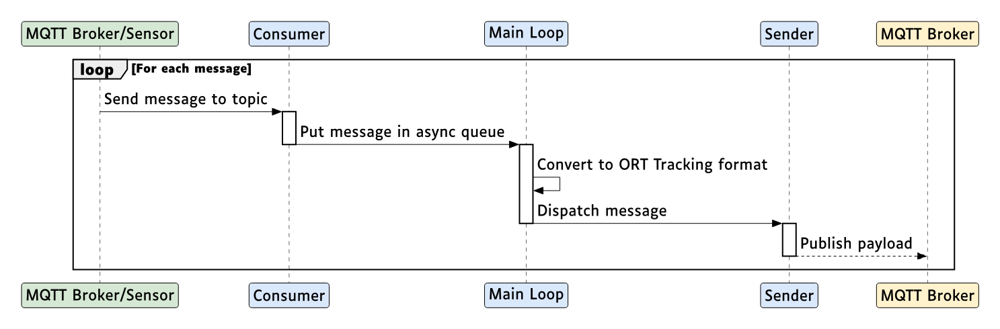

# Sensor Data Conversion - Developer Manual

## Architecture Overview

Sensor Data Conversion is an async Python application that converts messages in the OutSight format into the ORT Tracking format. It follows a driver/interface architecture with pluggable consumer backends and a modular converter pipeline.

### High-Level Data Flow

```
OutSight message producer -> Consumer (MQTT/Webhook) -> Converter (Coordinate Transform) -> Sender (MQTT)
```

1. **Consumer** receives raw OutSight JSON from sensors via MQTT subscription or HTTP webhook POST
2. **Converter** (`OutSightToAToBe`) performs coordinate transformations using ENU (East-North-Up) intermediates and numpy matrix operations, derives dimensions from bounding boxes, and produces ORT Tracking messages
3. **Sender** publishes converted messages to an MQTT broker on configurable topics

### Sequence diagram describing the flow



### Tech Stack

| Component       | Technology        | Version      | Purpose                                     |
| --------------- | ----------------- | ------------ | ------------------------------------------- |
| Runtime         | Python            | 3.13         | Application runtime                         |
| Package Manager | uv                | Latest       | Dependency management                       |
| Async Runtime   | asyncio           | stdlib       | Concurrency                                 |
| MQTT Client     | amqtt             | >=0.11.3     | Async MQTT publish/subscribe                |
| Webhook Server  | FastAPI + uvicorn | >=0.129.0    | HTTP POST endpoint for webhook consumer     |
| HTTP Client     | httpx             | (transitive) | Async HTTP (used by FastAPI)                |
| Data Validation | pydantic          | >=2.12.3     | Message parsing and settings models         |
| Settings        | pydantic-settings | >=2.11.0     | TOML/env config loading                     |
| Logging         | loguru            | >=0.7.3      | Structured logging                          |
| Linear Algebra  | numpy             | >=2.3.4      | Matrix operations for coordinate transforms |
| Geo Transforms  | pymap3d           | >=3.2.0      | Geodetic ↔ ENU coordinate conversion        |
| Linting         | ruff              | >=0.14.14    | Code style enforcement                      |
| Type Checking   | mypy              | >=1.18.2     | Static type analysis (strict mode)          |

### Design Patterns

- **Interface/Driver separation**: The consumer is defined via an abstract `ConsumerInterface` in `app/interfaces/consumer.py`, with concrete implementations in `app/drivers/consumer/`
- **Discriminated unions**: `ConsumerSettings` uses a Pydantic discriminated union on the `backend` field to select between `MQTTConsumerSettings`, `WebhookConsumerSettings`, or `DisabledConsumerSettings`
- **Factory pattern**: `app/drivers/consumer/__init__.py` exposes a `get_consumer()` factory function that reads settings and instantiates the correct driver
- **Guard clauses**: Each driver module includes a guard that raises `RuntimeError` if imported when the corresponding backend is not active
- **Context manager lifecycle**: Both consumer and sender expose async context managers for clean connection management

### Instantiation & Wiring

All component creation happens at **module import time**:

1. **Settings singleton**: `app/settings/__init__.py` creates a module-level `settings = Settings()` instance. It reads `config.toml` and applies any `SENSOR_DATA_CONVERSION_`-prefixed environment variable overrides.

2. **Driver instantiation**: `app/drivers/consumer/__init__.py` executes a `match` on `settings.consumer.backend` and conditionally imports + instantiates the correct backend.

3. **Service wiring**: `app/service.py` creates the consumer, sender, and converter, then orchestrates the async processing loop.
